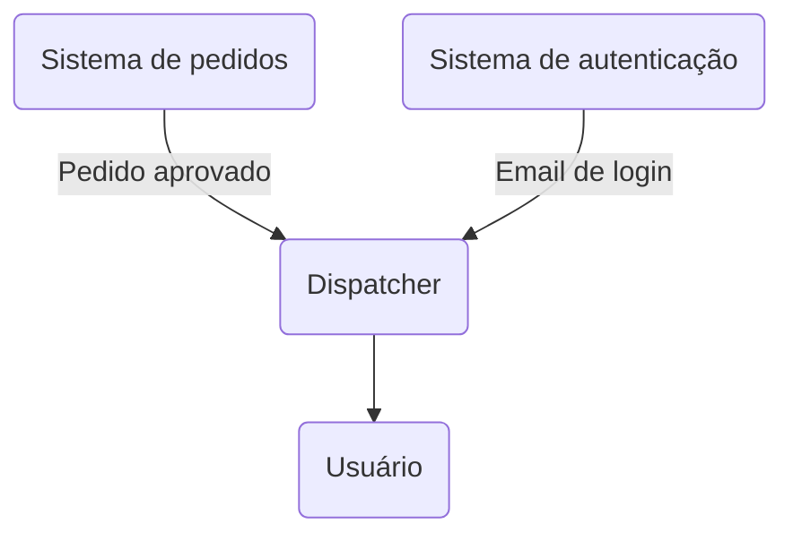

# Dispatcher

Dispatcher é um sistema de centralização de notificações enviadas por outros sistemas internos. Funciona como uma API recebendo as notificações a serem enviadas, então processa elas de forma assíncrona e distribuída.

Foi pensado para uso interno, provendo a outros sistemas o serviço de envio de notificações. Exemplo de fluxo:

## Funcionalidades principais

- Processamento das notificações com filas
- Envio de e-mails com Resend (futuramente envio Whatsapp e Push)
- Autenticação JWT e autorização para Admin
- Gerenciamento de Applications e API Keys para acesso da API
- Templates customizados

## Tech stack

### Principal

- NestJS (Express)
- Swagger
- Pino Logger
- Jest
- Supertest

### Database

- Prisma
- PostgreSQL

### Filas

- BullMQ
- Bull Board

### E-mail

- Nodemailer
- Resend
- React Email
- Mailpit (Dev)

### Segurança

- JWT
- Argon2
- Helmet
- Throttler (Rate limit)

## Como executar localmente
