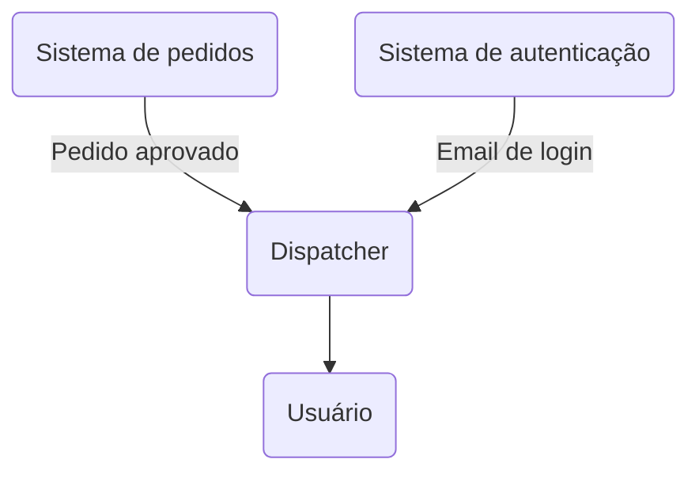

# Dispatcher

Dispatcher é um sistema de centralização de notificações enviadas por outros sistemas internos. Funciona como uma API recebendo as notificações a serem enviadas, então processa elas de forma assíncrona e distribuída.

Foi pensado para uso interno, provendo a outros sistemas o serviço de envio de notificações. Exemplo de fluxo:



## Funcionalidades principais

- Processamento das notificações com filas
- Envio de e-mails com Resend (futuramente envio Whatsapp e Push)
- Autenticação JWT e autorização para Admin
- Gerenciamento de Applications e API Keys para acesso da API
- Templates customizados

## Tech stack

### Principal

- NestJS (Express)
- Swagger
- Pino Logger
- Jest
- Supertest

### Database

- Prisma
- PostgreSQL

### Filas

- BullMQ
- Bull Board

### E-mail

- Nodemailer
- Resend
- React Email
- Mailpit (Dev)

### Segurança

- JWT
- Argon2
- Helmet
- Throttler (Rate limit)

## Como executar localmente

### Instalação

```bash
npm install
```

### Configuração do .env

Copie o arquivo de exemplo e preencha os valores necessários:

```bash
cp .env.example .env
```

### Docker

O projeto inclui um ambiente local com PostgreSQL, Redis e Mailpit:

```bash
docker compose -f docker-compose.dev.yml up -d
```

### Banco de dados

Após subir os containers, aplique as migrações do Prisma:

```bash
npx prisma migrate deploy
npx prisma generate
```

### Redis

O Redis é utilizado pelas filas BullMQ para processamento assíncrono de sincronização de processos e envio de e-mails. A configuração padrão usa localhost:6379.

### Prisma

Para visualizar ou gerenciar o schema e o client do Prisma:

```bash
npx prisma studio
```

### Execução da aplicação

Em modo desenvolvimento:

```bash
npm run start:dev
```
