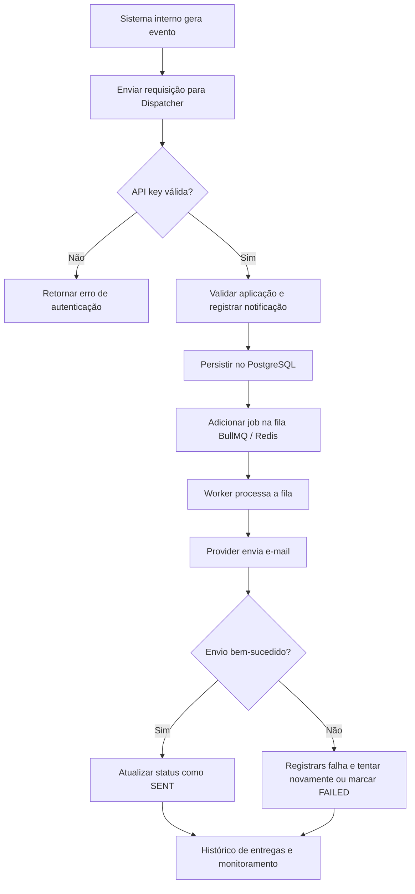

# Overview do projeto

## Visão geral

O Dispatcher é uma API interna para centralizar o envio de notificações entre sistemas da organização. Em vez de cada aplicação implementar sua própria lógica de e-mail, autenticação e rastreio, o Dispatcher atua como um serviço único de despacho de mensagens, recebendo requisições de múltiplos sistemas e processando-as de forma assíncrona.

A ideia central do projeto é separar a origem da notificação do mecanismo de entrega. Um sistema como "pedidos", "autenticação" ou "contas" pode simplesmente enviar uma solicitação para a API do Dispatcher, e a plataforma se encarrega de persistir a mensagem, enfileirá-la e entregar o conteúdo ao canal correto.

O projeto já foi pensado para suportar diferentes canais no futuro, como e-mail, WhatsApp e push notifications, mas a implementação atual tem foco em e-mails, com infraestrutura preparada para extensão.

## Objetivo do sistema

O Dispatcher resolve alguns problemas comuns em sistemas internos:

- Centraliza o envio de notificações em um único serviço
- Reduz duplicação de código entre aplicações
- Permite rastrear status de cada notificação
- Isola cada origem por aplicação e chave de acesso
- Processa mensagens em fila para evitar bloqueios na API
- Oferece controle administrativo para gerenciar aplicações, chaves e usuários admin.

## Fluxo principal da aplicação

O fluxo típico funciona assim:

1. Uma aplicação interna gera um evento, por exemplo: "pedido aprovado", "email de verificação" ou "reset de senha".
2. Essa aplicação chama a API do Dispatcher, autenticando-se com uma API key própria.
3. O Dispatcher valida a chave de acesso, identifica a aplicação que a enviou e registra a notificação no banco.
4. A notificação entra em um processo assíncrono via BullMQ/Redis.
5. Um worker consome a fila e executa o envio real do e-mail.
6. O provider responsável pelo canal envia a mensagem usando Mailpit em ambiente local ou Resend em produção.
7. O status da notificação é atualizado para enviado, falho ou cancelado, mantendo histórico de erros e tentativas.

## Fluxo de autenticação e autorização

O sistema possui dois níveis de acesso bem distintos:

### 1. Autenticação de aplicações externas

- Cada sistema cliente é representado por um registro de Application.
- Cada aplicação possui uma ou mais API keys.
- A chave é armazenada em formato seguro: parte do prefixo fica em banco para identificação e o hash completo é usado para validação.
- A autenticação é feita via header de autorização do tipo Bearer.
- O guard ApiKeyGuard verifica a chave, valida a aplicação, checa se ela está ativa, se não expirou e se não foi revogada.

Isso permite que diferentes sistemas internos consumam o serviço isolados por aplicação, sem compartilhar credenciais entre si.

### 2. Autenticação de administradores

- Os administradores possuem usuários em AdminUser.
- O login é feito em /auth usando email e senha.
- O JWT é emitido com dados do usuário, como sub, role e status.
- Os guards AdminAuthGuard e AdminRolesGuard controlam acesso aos endpoints de administração.
- Há suporte a roles ADMIN e OPERATOR, com permissões diferenciadas para criar, listar e gerenciar aplicações e chaves.

## Arquitetura do sistema

A arquitetura segue o modelo de módulos do NestJS, com separação clara entre camada web, serviços, infraestrutura e dados.

### Módulos principais

- AppModule: módulo raiz que registra configuração global, logger, rate limit, Redis/BullMQ, Bull Board e os módulos principais.
- NotificationsModule: responsável pelo fluxo de notificações, incluindo controller, serviço e worker de fila.
- ApplicationsModule: gerencia as aplicações clientes do sistema.
- ApiKeyModule: gerencia as chaves de API vinculadas a cada aplicação.
- AdminUserModule: gerencia usuários administradores.
- AdminAuthModule: autenticação e emissão de JWT para administração.

### Camada de apresentação

Os controllers expõem endpoints REST para:

- autenticação administrativa
- cadastro e gestão de aplicações
- criação e gerenciamento de API keys
- envio de notificações.

Os controles de acesso fazem parte da camada de segurança e são aplicados com decorators e guards.

### Camada de aplicação

Os services encapsulam a lógica de negócio:

- ApplicationsService: CRUD de aplicações.
- ApiKeyService: geração, validação, revogação e atualização de chaves.
- NotificationsService: orquestra a criação e processamento das notificações.
- AdminAuthService: valida admin e gera token JWT.

### Camada de infraestrutura

A infraestrutura concentra a integração com tecnologias externas:

- PrismaService: acesso ao banco de dados.
- DatabaseModule: disponibiliza a conexão do Prisma.
- BullMQ: fila de processamento assíncrono.
- Redis: broker da fila.
- EmailProvider: abstração para provedores de e-mail.
- MailpitEmailProvider: provedor local para desenvolvimento.
- ResendEmailProvider: provedor de produção.
- Bull Board: painel visual da fila.
- Pino Logger: logging estruturado.

### Templates customizados

A camada de templates funciona como um registrador de renderização para cada tipo de mensagem. O projeto define um enum de templates, e cada template é resolvido por uma função específica que cria o conteúdo email em HTML e em texto puro.

A estrutura segue um padrão simples e extensível:

- um resolver mapeia o tipo de template para a função responsável
- as variáveis de cada template são tipadas por interface
- a renderização é feita com React Email, gerando HTML rico e texto alternativo
- os templates podem ser reutilizados em diferentes fluxos de negócio.

No momento, o projeto já entrega casos concretos como:

- Email de verificação
- Redefinição de senha

Esse design permite que a aplicação tenha mensagens padronizadas, com conteúdo amigável, links dinâmicos e suporte à personalização por variável. Para um primeiro ciclo, essa abordagem funciona bem e mantém a funcionalidade desacoplada da lógica de negócio. No entanto, se a necessidade for personalizar templates por cliente, versioná-los ou permitir edição sem novo deploy, essa solução passa a ser limitada. Expor uma rota administrativa para gerenciar templates ajudaria a desacoplar melhor a camada de apresentação da aplicação e deixaria o sistema mais flexível para evolução.

### Persistência

O projeto usa Prisma com PostgreSQL e o schema define as entidades principais:

- Application: representa cada sistema cliente do Dispatcher.
- ApiKey: representa uma chave de acesso da aplicação, com hash, prefixo, expiração e revogação.
- Notification: representa cada notificação enviada, com destinatário, canal, template, payload, status e tentativas.
- AdminUser: representa usuários do painel administrativo.

Além disso, o schema já contempla enums para canais (
EMAIL, PUSH, WHATSAPP), status (PENDING, PROCESSING, SENT, FAILED, CANCELED) e templates pré-definidos.

## Estrutura funcional da arquitetura

O projeto pode ser visto como uma arquitetura orientada por eventos assíncronos, com três blocos principais:

### 1. Entrada e validação

Recebe requisições externas ou administradores e valida:

- headers de auth
- payloads de entrada
- permissões por papel
- limites de taxa (throttling).

### 2. Persistência e controle

Armazena informações de aplicação, chave de acesso, usuário admin e notificações em PostgreSQL, mantendo um histórico confiável e rastreável.

### 3. Processamento assíncrono

As notificações são enviadas para fila e consumidas por workers do BullMQ. Isso evita que a API principal permaneça bloqueada por operações lentas, como envio de e-mail ou integração externa.

## Fluxo de execução em desenvolvimento

Em ambiente local, o projeto é apoiado por:

- PostgreSQL
- Redis
- Mailpit

A configuração do docker-compose.dev.yml prepara esse ambiente para rodar a aplicação localmente com infra pronta para testes e desenvolvimento.

## Conclusão

O Dispatcher é um serviço de orquestração de notificações com foco em modularidade, segurança e processamento assíncrono. Sua arquitetura permite que sistemas internos enviem mensagens de forma padronizada, enquanto a plataforma cuida da persistência, autenticação, fila e entrega.

A principal vantagem do projeto está na separação entre o que gera a notificação e o que a entrega: a camada cliente envia um evento, a API valida o contexto e o sistema realiza o processamento de forma desacoplada, confiável e escalável.
