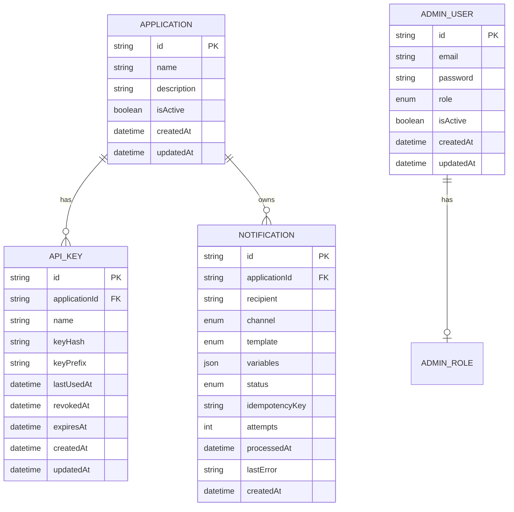

# Banco de dados e schema

## Visão geral

A persistência é feita com PostgreSQL e o acesso ao banco é gerenciado via Prisma. A modelagem foi pensada para sustentar uma arquitetura de notificações assíncronas, em que a API aceita requisições rapidamente, registra a operação e depois a entrega acontece em background por fila. O schema inclui:

- Usuários administradores
- Aplicações clientes que consumem a API
- Chaves de acesso de cada aplicação
- Notificações processadas e rastreáveis
- Status e histórico de envio.

## Tecnologias e configuração

- Banco: PostgreSQL
- ORM: Prisma
- Client gerado: `src/generated/prisma`
- Generação do cliente: `prisma generate`
- Migrations: controladas via Prisma Migrate

## Modelo relacional

O esquema principal pode ser descrito da seguinte forma:



## Enums principais

### AdminRole

```prisma
enum AdminRole {
  ADMIN
  OPERATOR
}
```

Representa os papéis administrativos do sistema.

- ADMIN: tem autonomia total para criar e alterar aplicações, chaves e perfis administrativos.
- OPERATOR: acessa áreas de operação e consulta, mas normalmente não realiza ações sensíveis de administração.

Esses papéis são usados pelos guards de autorização no NestJS e controlam os endpoints de administração.

### NotificationChannel

```prisma
enum NotificationChannel {
  EMAIL    @map("email")
  PUSH     @map("push")
  WHATSAPP @map("whatsapp")
}
```

Define os canais de entrega suportados pelo sistema.

- `EMAIL`: e-mail
- `PUSH`: push notification
- `WHATSAPP`: WhatsApp

É importante notar que o enum já prevê suporte para múltiplos canais, porém a implementação atual ainda está focada em e-mail.

### NotificationStatus

```prisma
enum NotificationStatus {
  PENDING
  PROCESSING
  SENT
  FAILED
  CANCELED
}
```

Esse enum controla o estado da notificação durante o ciclo de processamento.

- `PENDING`: aguardando processamento
- `PROCESSING`: em andamento
- `SENT`: entregue com sucesso
- `FAILED`: falhou na entrega
- `CANCELED`: cancelada antes ou durante o processamento

Esse status é essencial para observabilidade e rastreio. Em uma arquitetura assíncrona, ele permite saber se a mensagem já saiu, se está em fila, se houve erro ou se foi cancelada.

### NotificationTemplate

```prisma
enum NotificationTemplate {
  WELCOME            @map("welcome")
  EMAIL_VERIFICATION @map("email_verification")
  PASSWORD_RESET     @map("password_reset")
}
```

Representa os templates disponíveis no sistema. O schema já antecipa tipos de mensagem comuns:

- boas-vindas
- verificação de e-mail
- redefinição de senha.

A resolução desses templates acontece em código por meio do `template.resolver.ts`, que mapeia o enum para uma função de renderização.

## Entidades

### 1. AdminUser

```prisma
model AdminUser {
  id        String    @id @default(uuid())
  email     String    @unique
  password  String
  role      AdminRole
  isActive  Boolean   @default(true)
  createdAt DateTime  @default(now())
  updatedAt DateTime  @default(now()) @updatedAt
}
```

Responsável por autenticar usuários do painel administrativo.

Campos:

- `id`: identificador UUID.
- `email`: e-mail único.
- `password`: senha armazenada em hash, usando Argon2.
- `role`: papel do administrador.
- `isActive`: permite desativar o usuário sem apagar o registro.
- `createdAt` e `updatedAt`: timestamps de auditoria.

Observação: no seed do projeto, um administrador inicial é criado usando `argon2.hash(...)` e `upsert` por e-mail.

### 2. Application

```prisma
model Application {
  id          String   @id @default(uuid())
  name        String
  description String?
  isActive    Boolean  @default(true)
  createdAt   DateTime @default(now())
  updatedAt   DateTime @default(now()) @updatedAt

  apiKeys       ApiKey[]
  notifications Notification[]

  @@index([isActive])
}
```

Representa qualquer sistema cliente que usa o Dispatcher.

Exemplos reais do projeto: sistemas internos, módulos de autenticação, pedidos, contas, etc.

Funções dessa entidade:

- identificar quem está enviando notificações
- permitir que cada sistema tenha chaves exclusivas
- controlar se a aplicação está ativa ou inativa
- manter histórico de notificações por origem.

O campo `isActive` é importante porque a aplicação pode ficar desabilitada sem remover o registro, evitando quebrar integrações antigas.

### 3. ApiKey

```prisma
model ApiKey {
  id            String    @id @default(uuid())
  applicationId String
  name          String
  keyHash       String    @unique
  keyPrefix     String    @unique
  lastUsedAt    DateTime?
  revokedAt     DateTime?
  expiresAt     DateTime?
  createdAt     DateTime  @default(now())
  updatedAt     DateTime  @default(now()) @updatedAt

  application Application @relation(fields: [applicationId], references: [id], onDelete: Restrict)

  @@index([applicationId])
  @@index([keyPrefix])
}
```

Essa é uma das entidades centrais para a segurança da aplicação.

#### Regras e objetivos

- cada aplicação pode ter várias chaves
- a `keyHash` armazena o hash completo da chave nunca deve ser exposta
- a `keyPrefix` identifica a chave de forma segura e é usada para busca inicial
- `lastUsedAt` permite rastrear uso recente
- `revokedAt` permite revogar a chave sem excluir o registro
- `expiresAt` pode estabelecer validade futura.

#### Por que usar `keyPrefix` + `keyHash`?

A aplicação não armazena a chave completa em texto puro. Em vez disso, ela:

1. gera uma chave aleatória
2. salva um prefixo para identificação
3. salva o hash completo da chave para validação.

Isso reduz riscos em caso de vazamento do banco, porque o valor real da chave não fica exposto em texto claro.

#### Relação com Application

A chave sempre pertence a uma `Application` e a relação é com `onDelete: Restrict`, ou seja, a aplicação não pode ser removida enquanto houver chaves ligadas a ela. Essa decisão ajuda a preservar integridade e segurança.

### 4. Notification

```prisma
model Notification {
  id             String               @id @default(uuid())
  applicationId  String
  recipient      String
  channel        NotificationChannel
  template       NotificationTemplate
  variables      Json
  status         NotificationStatus   @default(PENDING)
  idempotencyKey String?
  attempts       Int                  @default(0)
  processedAt    DateTime?
  lastError      String?
  createdAt      DateTime             @default(now())

  application Application @relation(fields: [applicationId], references: [id], onDelete: Restrict)

  @@unique([applicationId, idempotencyKey])
  @@index([applicationId])
  @@index([status])
  @@index([createdAt])
}
```

Essa entidade representa a notificação em si.

#### Campos importantes

- `applicationId`: quem enviou a mensagem
- `recipient`: destinatário da notificação
- `channel`: canal de envio (email, push, whatsapp)
- `template`: template associado
- `variables`: payload dinâmico em JSON, usado para personalizar a mensagem
- `status`: estado da notificação
- `idempotencyKey`: evita duplicidade por aplicação
- `attempts`: número de tentativas
- `processedAt`: data do processamento final
- `lastError`: última falha registrada
- `createdAt`: data de criação da notificação.

#### Idempotência

A combinação de `applicationId` e `idempotencyKey` é única:

```prisma
@@unique([applicationId, idempotencyKey])
```

Esse campo existe para proteger o sistema contra duplicidade de processamento. Em sistemas distribuídos e assíncronos, a mesma operação pode ser enviada mais de uma vez por timeout, retry, clique duplo ou falhas na rede. Sem essa proteção, uma mesma ação poderia gerar múltiplas notificações iguais ou disparar e-mails duplicados.

A lógica é simples: para uma mesma aplicação, a `idempotencyKey` precisa ser única. Assim, se o cliente tentar enviar a mesma notificação duas vezes com a mesma chave, o banco rejeita a segunda tentativa e o sistema consegue tratar a duplicidade de forma controlada.

Exemplo prático:

- aplicação: `auth-service`
- template: `EMAIL_VERIFICATION`
- recipient: `ana@email.com`
- idempotencyKey: `email-verification-user-42`

Se o mesmo evento vier novamente com a mesma `idempotencyKey`, o Prisma não permitirá inserir um segundo registro para a mesma combinação `applicationId + idempotencyKey`.

Esse comportamento é importante no projeto porque o Dispatcher usa fila assíncrona, processamento em background e possíveis retries. Sem idempotência, o sistema ficaria vulnerável a duplicação de mensagens, inconsistência de status e múltiplos envios para o mesmo destinatário.

#### JSON para variáveis

O campo `variables` usa `Json`, e isso permite flexibilidade para cada template. Exemplo de payload:

```json
{
  "name": "Ana",
  "url": "https://app.example.com/confirm/abc123"
}
```

Assim, o template de confirmação de cadastro consegue montar um e-mail específico com dados do destinatário sem precisar criar colunas rígidas para cada caso.

## Relacionamentos

### Application -> ApiKey

Uma aplicação pode ter várias chaves de acesso, mas cada chave pertence a uma única aplicação.

### Application -> Notification

Uma aplicação pode gerar muitas notificações, mas cada notificação pertence a uma única aplicação.

### AdminUser

É independente das outras entidades e representa entidades administrativas do sistema, não clientes externos.

## Índices e desempenho

O schema contém índices para melhorar leitura e filtros operacionais:

- `Application`: `@@index([isActive])`
- `ApiKey`: `@@index([applicationId])` e `@@index([keyPrefix])`
- `Notification`: `@@index([applicationId])`, `@@index([status])`, `@@index([createdAt])`

Esses índices ajudam em:

- listar aplicações ativas
- localizar chave por prefixo
- buscar notificações por aplicação
- filtrar notificações por status
- ordenar por data de criação.

## Regras de integridade

Algumas regras importantes do schema e da aplicação são:

- `Application` não pode ser removida se houver `ApiKey` ou `Notification` vinculados,
  porque a relação usa `onDelete: Restrict`
- `ApiKey` e `Notification` têm identidade única por certos critérios
- `AdminUser.email` é único
- `ApiKey.keyHash` e `ApiKey.keyPrefix` também são únicos
- `Notification.status` sempre será um valor previsto pelo enum.

Essas condições ajudam a manter a consistência do banco e reduzem erros de dados.

## Fluxo de uso do banco na aplicação

### 1. Cadastro de aplicação

A aplicação cria um registro em `Application` para representar um cliente interno.

### 2. Criação da API key

O sistema gera uma nova chave e salva:

- `name`
- `applicationId`
- `keyHash`
- `keyPrefix`
- `expiresAt`, quando existir
- `revokedAt`, quando houver revogação.

### 3. Envio de notificação

Ao receber uma notificação, a API grava um registro em `Notification` com:

- destinatário
- template
- payload em JSON
- status inicial `PENDING`
- `idempotencyKey` para evitar duplicidade.

### 4. Processamento assíncrono

O worker consome a fila, busca a notificação e atualiza o registro conforme o fluxo:

- `PENDING` -> `PROCESSING`
- sucesso -> `SENT`
- falha -> `FAILED`
- cancelamento -> `CANCELED`

### 5. Auditoria e diagnóstico

Os campos `lastError`, `attempts`, `processedAt` e `createdAt` ajudam a monitorar falhas e comportamentos do sistema.

## Seed e bootstrap de ambiente

O arquivo [prisma/seed.ts](../prisma/seed.ts) cria um usuário administrador inicial.

Ele:

- lê `ADMIN_EMAIL` e `ADMIN_PASSWORD` do ambiente
- gera um hash Argon2 da senha
- faz `upsert` no `AdminUser` por e-mail
- cria um usuário administrador padrão para iniciar a plataforma.

Esse mecanismo torna o ambiente local fácil de iniciar e garante que a API administrativa tenha um usuário inicial para autenticação.

## Migrations

O projeto já possui migrações em [prisma/migrations](../prisma/migrations), como:

- criação inicial do schema
- inclusão de mappers e admin user
- ajuste de `keyPrefix` e unicidade.

Isso mostra que o esquema evoluiu com o tempo e que a base foi ajustada para suportar requisitos novos, especialmente em segurança e identidade de chaves.

## Observações de design

O banco está bem alinhado com o objetivo do produto, principalmente por:

- separar clientes externos (`Application`) de usuários administrativos (`AdminUser`)
- isolar autenticação de aplicação em `ApiKey`
- manter rastreabilidade de notificações em `Notification`
- usar `Json` para flexibilidade de templates
- suportar processamento assíncrono sem bloquear a API principal.

A principal característica de projeto é que a base de dados não apenas registra dados, mas também funciona como fonte de verdade para autenticação, rastreio e observabilidade da entrega das mensagens.

## Conclusão

O schema da aplicação é simples, mas bem pensado para o contexto de um serviço de notificações interno. Ele separa responsabilidades por entidade, aplica segurança de autenticação e oferece acompanhamento completo do ciclo de vida das mensagens.

A modelagem atual é adequada para um MVP produtivo e para um ambiente de operação interna, com espaço para evoluções futuras como gestão de templates e customizações mais avançadas por cliente.
