# Arquitetura do sistema

## Visão geral

O Dispatcher é uma API NestJS dedicada a centralizar o envio de notificações internas. Sua arquitetura é organizada em camadas bem definidas:

- camada HTTP e endpoints;
- camada de aplicação com serviços e casos de uso;
- camada de segurança com guards e autenticação;
- camada de infraestrutura com Prisma, Redis, BullMQ e provedores de e-mail;
- camada de persistência com PostgreSQL.

A principal ideia da arquitetura é separar a geração da notificação da entrega real da mensagem. A API recebe a solicitação, valida o contexto, grava o evento em banco e devolve rapidamente a resposta, enquanto o processamento pesado acontece em background por fila.

Essa abordagem reduz o tempo de resposta da API e torna o sistema mais resiliente em cenários de picos de tráfego, delays externos e retries de entrega.

## Padrão arquitetural

O projeto segue uma arquitetura modular baseada em NestJS, com uma estrutura de módulos e serviços que favorece organização e escalabilidade inicial.

### Camadas principais

#### 1. Camada de entrada HTTP

Responsável por expor endpoints REST e receber requisições do cliente.

Exemplos de módulos com foco nessa camada:

- ApplicationsController
- ApiKeyController
- AdminAuthController
- NotificationsController

Esses controllers fazem a ponte entre entrada da rede e services de domínio.

#### 2. Camada de aplicação

Encapsula a lógica de negócio e coordena operações do sistema.

Exemplos:

- ApplicationsService
- ApiKeyService
- AdminAuthService
- NotificationsService

Esses serviços orquestram regras de negócio, validações e integrações com o banco de dados e demais infraestruturas.

#### 3. Camada de infraestrutura

Responsável por integrações com sistemas externos e recursos de baixo nível.

Inclui:

- PrismaService
- EmailProvider
- ResendEmailProvider
- MailpitEmailProvider
- BullMQ e Redis
- Logger estruturado
- Bull Board

#### 4. Camada de persistência

A camada de dados fica em PostgreSQL e é acessada via Prisma.

Ela guarda:

- aplicações;
- chaves de API;
- usuários administrativos;
- notificações e status dos envios.

## Estrutura de módulos

A estrutura principal da aplicação está concentrada em `AppModule`, que registra os módulos globais e de infraestrutura.

### AppModule

O módulo raiz faz o bootstrap da aplicação com configurações globais:

- `ConfigModule.forRoot({ isGlobal: true })`
- `LoggerModule.forRootAsync(...)`
- `ThrottlerModule.forRoot(...)`
- `BullModule.forRootAsync(...)`
- `BullBoardModule.forRootAsync(...)`
- módulos de negócio: `NotificationsModule`, `ApiKeyModule`, `ApplicationsModule`, `AdminUserModule`, `AdminAuthModule`

Também registra um guard global de rate limiting:

- `APP_GUARD` com `ThrottlerGuard`

Esse design centraliza segurança e infraestrutura em um único ponto de configuração, reduzindo duplicação e tornando o comportamento consistente para toda a aplicação.

### NotificationsModule

Este módulo concentra o fluxo principal de processamento de mensagens.

Ele importa:

- `DatabaseModule`
- `QueuesModule`

E registra:

- `NotificationsController`
- `NotificationsService`
- `NotificationsEmailProcessor`
- provider de e-mail via `EmailProvider`

Esse módulo é o coração do sistema: ele cria a fila, processa os jobs e envia a comunicação por provedor escolhido.

### ApplicationsModule

Responsável pela gestão das aplicações que consomem a API.

Inclui:

- listagem e busca de aplicações;
- criação e atualização;
- controle de status ativo/inativo;
- regras de autorização para administradores.

### ApiKeyModule

Responsável pela gestão de credenciais de acesso das aplicações.

A lógica central é:

- gerar chaves;
- validar prefixo e hash;
- expirar ou revogar chaves;
- registrar `lastUsedAt`;
- impedir que aplicações inativas ou revogadas continuem acessando a API.

### AdminUserModule

Gerencia usuários administrativos e seu relacionamento com autenticação.

Esse módulo é responsável por:

- localizar usuário por email;
- localizar usuário por id;
- verificar senha com Argon2;
- apoiar a validação de JWT para admin.

### AdminAuthModule

O módulo administrativo cuida de autenticação e geração de JWT.

Ele expõe o endpoint de login e usa:

- `AdminUserService` para validar credenciais;
- `JwtService` para emitir token;
- `AdminAuthGuard` para proteger rotas administrativas.

## Fluxo de requisição e ciclo de vida

### 1. Recepção da requisição

Quando uma requisição entra na API, o NestJS faz o processamento padrão:

- validação global com `ValidationPipe`;
- middleware e helmet;
- autenticação via guard;
- autorização por roles ou escopo de aplicação;
- rate limiting pelo Throttler.

O `main.ts` registra o `ValidationPipe` com:

- `whitelist: true`
- `transform: true`
- `forbidNonWhitelisted: true`

Isso força que apenas propriedades esperadas sejam aceitas no payload, reduzindo risco de payloads maliciosos ou inconsistentes.

### 2. Autenticação da aplicação cliente

A autenticação de sistemas clientes usa `ApiKeyGuard`.

Fluxo:

1. lê `Authorization: Bearer <token>`;
2. extrai prefixo e chave;
3. chama `ApiKeyService.isApiKeyValid()`;
4. valida se a chave existe, se a aplicação está ativa, se não foi revogada e se não expirou;
5. atribui `request['application'] = applicationId`;
6. atualiza `lastUsedAt` de forma assíncrona.

Se a validação falhar, a autenticação retorna `UnauthorizedException`.

### 3. Autenticação administrativa

Para rota administrativa, o fluxo é diferente:

1. a requisição inclui JWT no header;
2. `AdminAuthGuard` verifica o token usando `JwtService`;
3. busca o admin pelo `sub`;
4. valida se o usuário existe e está ativo;
5. insere `request['user'] = payload`;
6. `AdminRolesGuard` aplica as permissões por papel.

A autorização é orientada por decorator `@AdminRoles(...)`.

## Segurança e autorização

A aplicação separa claramente dois contextos de segurança:

### Segurança de cliente

- `ApiKeyGuard`
- valida tokens de aplicação usando chave hash + prefixo
- usa `applicationId` como contexto da requisição

### Segurança de admin

- `AdminAuthGuard`
- valida JWT
- `AdminRolesGuard`
- restringe ações conforme `ADMIN` ou `OPERATOR`

Também há proteção de rate limit por Throttler e `helmet` para hardening da API em produção.

## Fila assíncrona e processamento

A fila é o principal mecanismo de desacoplamento do projeto.

### Configuração de fila

O sistema usa BullMQ com Redis.

Configuração centralizada em `getBullQueueConfig()`:

- host e porta do Redis via `REDIS_HOST` e `REDIS_PORT`;
- `attempts: 5` para retentativas;
- `backoff` exponencial com delay de 3 segundos;
- `removeOnComplete` e `removeOnFail` para limpeza de jobs antigos.

Isso deixa o sistema tolerante a falhas temporárias e evita crescimento descontrolado da fila.

### Fila atual

O projeto define a fila principal:

```ts
const QUEUES = {
  EMAIL: 'email',
};
```

Ou seja, o processamento principal hoje é de envio de e-mails.

### Worker

A lógica do worker está em `NotificationsEmailProcessor`.

Ele é anotado com `@Processor(QUEUES.EMAIL)` e delega a execução para `NotificationsService.sendEmailNotificationFromJob(job)`.

Essa estrutura permite que a API não tenha que esperar a entrega do e-mail; ela apenas registra a intenção e envia a tarefa para a fila.

## Fluxo completo de notificação

```mermaid
flowchart LR
    A[Sistema cliente] --> B[POST /notifications]
    B --> C[Auth via API Key]
    C --> D[Valida aplicação e payload]
    D --> E[Persiste Notification no PostgreSQL]
    E --> F[Enfileira job BullMQ]
    F --> G[Worker consume job]
    G --> H[Resolve template]
    H --> I[Seleciona provedor de e-mail]
    I --> J[Mailpit em dev / Resend em prod]
    J --> K[Atualiza status SENT ou FAILED]
    K --> L[Auditoria e monitoramento]
```



### Detalhamento do fluxo

1. O cliente envia a notificação para a API.
2. O guard de API key autentica a origem.
3. A mensagem é registrada em `Notification` com status `PENDING`.
4. O job é enfileirado para processamento.
5. O worker busca a notificação e aplica a lógica de envio.
6. O template correspondente é resolvido.
7. O provider envia o e-mail.
8. O sistema atualiza `status`, `attempts`, `processedAt`, `lastError`.

Esse fluxo é a base da arquitetura de entrega assíncrona do projeto.

## Provedores de e-mail

A arquitetura abstracta os provedores de e-mail via `EmailProvider`.

### Abstração

```ts
export abstract class EmailProvider {
  abstract sendEmail(params: SendEmailParams): Promise<SendEmailReturn>;
}
```

Essa interface permite trocar a implementação sem alterar o restante do módulo de notificações.

### Implementações

#### MailpitEmailProvider

Usado em ambiente local.

- conecta com Mailpit em `localhost:1025`;
- útil para testar envio sem depender de serviços externos;
- facilita desenvolvimento e QA local.

#### ResendEmailProvider

Usado em ambiente de produção.

- se conecta à API do Resend;
- usa `RESEND_API_KEY` e `RESEND_FROM`;
- retorna o identificador do e-mail enviado quando disponível.

A escolha do provider é feita em tempo de execução por `getEmailProvider()`:

```ts
if (process.env.NODE_ENV === 'production') {
  return ResendEmailProvider;
}

return MailpitEmailProvider;
```

Isso deixa o código pronto para ambientes diferentes sem alterar o fluxo principal.

## Templates e renderização

A parte de templates também é modular e extensível.

O resolver em `template.resolver.ts` mapeia cada enum de template para uma função responsável por montar o corpo do e-mail.

Exemplos atuais:

- `EMAIL_VERIFICATION`
- `PASSWORD_RESET`

Esses templates usam `react-email` para renderizar HTML e gerar o texto alternativo (plain text), o que melhora a compatibilidade com clientes de e-mail e facilita a apresentação.

A arquitetura aqui é simples e clara:

- `Notification.template` define a categoria;
- `resolveNotificationTemplate()` decide qual renderizador usar;
- o HTML final é enviado para o provider de e-mail.

## Persistência e consistência

A camada de dados usa Prisma para centralizar acesso ao banco e manter consistência.

### Entidades principais

- `Application`: sistema cliente
- `ApiKey`: credencial de autorização do cliente
- `Notification`: mensagem a ser enviada
- `AdminUser`: usuário autorizado para o painel administrativo

### Relacionamentos

- `Application` tem muitos `ApiKey`
- `Application` tem muitas `Notification`
- `ApiKey` pertence a uma `Application`
- `Notification` pertence a uma `Application`

Além disso, o projeto aplica regras importantes de unicidade:

- `email` único em `AdminUser`
- `keyHash` único em `ApiKey`
- `keyPrefix` único em `ApiKey`
- `applicationId + idempotencyKey` único em `Notification`

Esses contraints ajudam a manter a integridade do domínio e evitar inconsistências de negócio.

## Observabilidade e diagnóstico

A arquitetura também foi pensada para observabilidade.

### Logging

O projeto usa `nestjs-pino` para logging estruturado.

Isso facilita:

- rastrear requisições;
- registrar erro de e-mail;
- acompanhar processamento;
- distinguir eventos por módulo.

### Estado da notificação

A entidade `Notification` guarda dados fundamentais para diagnóstico:

- `status`
- `attempts`
- `lastError`
- `processedAt`
- `createdAt`

Esses valores permitem revisar falhas, repetir tentativas e entender o histórico de envio.

## Painel de filas

O Bull Board está exposto em `/queues`, com autenticação básica.

Isso dá uma visibilidade operacional direta da fila para o time de desenvolvimento ou operações:

- número de jobs;
- status da fila;
- historico de processamento;
- falhas e retries.

A configuração do painel é centralizada e protegida por usuário e senha configurados em ambiente.

## Tratamento de erros

A arquitetura adota a estratégia de falha explícita e rastreável.

Quando um e-mail falha:

- o provider lança exceção;
- o worker registra o erro no contexto da job;
- a fila controlada pelo BullMQ trata o retry;
- a notificação mantém informação de erro para diagnóstico.

Esse design é importante porque a entrega real da comunicação ocorre fora do ciclo de resposta HTTP. O sistema precisa registrar falhas sem interromper o fluxo principal.

## Ponto de extensão

A arquitetura está preparada para crescer sem desorganizar o projeto.

### Possíveis extensões futuras

- mais canais: WhatsApp, push, SMS;
- gerenciamento de templates por API ou painel administrativo;
- versionamento de templates;
- múltiplos provedores por canal;
- dashboards de métricas;
- observabilidade mais rica com OpenTelemetry;
- fila separada por canal e prioridade.

A estrutura atual já separa bem as responsabilidades, então adicionar novos canais ou provedores será mais simples, bastando seguir os padrões de módulo, serviço e abstração.

## Resumo arquitetural

A arquitetura do Dispatcher pode ser resumida assim:

- a API recebe requisições e valida segurança;
- os serviços gerenciam a lógica de negócio;
- o banco de dados mantém o estado das entidades;
- o Redis + BullMQ desacopla o processamento pesado;
- os workers executam o envio real de e-mails;
- provedores externos encapsulam a entrega final;
- logs, status e fila permitem acompanhamento e operação.

Em outras palavras, a aplicação foi desenhada como uma plataforma de orquestração de notificações: a entrada fica simples, a persistência garante rastreabilidade e o processamento assíncrono garante escalabilidade operacional.

## Conclusão

A arquitetura do Dispatcher é clara, modular e adequada para um sistema interno de notificações. Ela combina autenticação forte, regras de negócio bem delimitadas, processamento assíncrono e integração simples com diferentes provedores de e-mail.

O desenho atual oferece um bom equilíbrio entre simplicidade e extensibilidade, e está posicionado como uma base sólida para evoluir para novos canais e cenários de customização sem quebrar a estrutura já existente.
